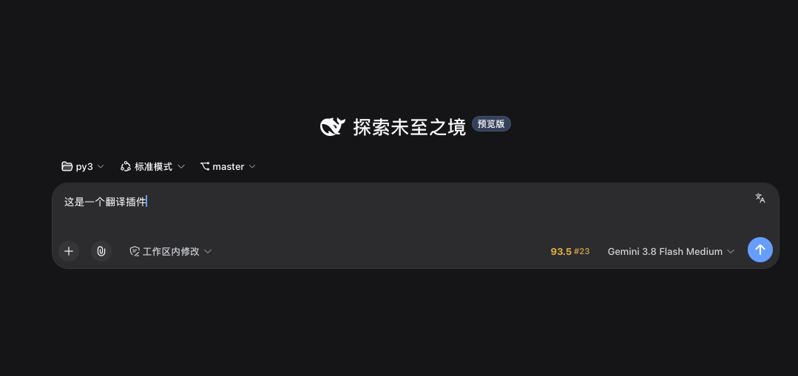
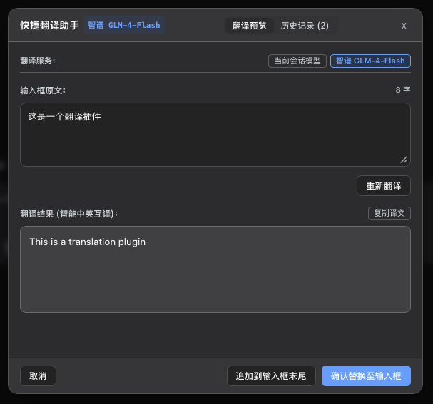
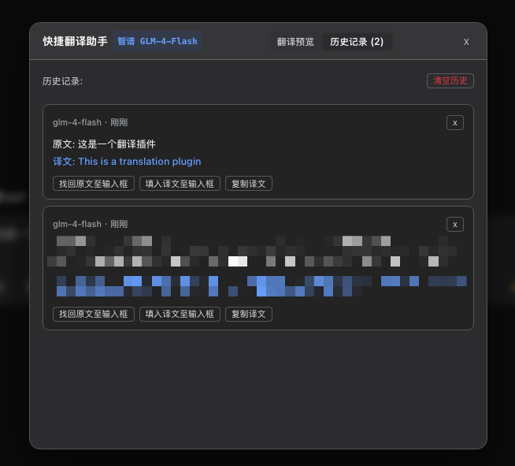
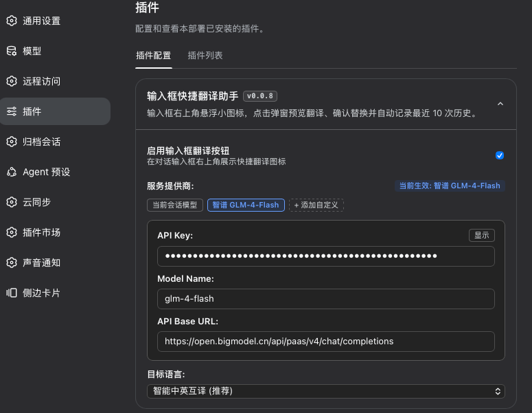

# DSH Input Translator (输入框快捷翻译助手)

基于 DeepSeek Harness (DSH) 插件规范打造的输入框悬浮快捷翻译与历史找回挂件。支持直接复用当前会话已选大模型，内置智谱 AI 免费模型预设，并支持添加多个自定义 OpenAI 兼容接口。

---

## 功能特性

### 1. 输入框右上角悬浮入口
- 挂载于对话输入框卡片内部右上角，与原有界面布局平齐融合；
- 输入框存在草稿文本时自动激活高亮，点击即可唤起翻译弹窗。



### 2. 双向翻译对比与确认替换
- **智能互译**：自动识别输入语言，中文自动翻译为英文，英文及外语自动翻译为中文；
- **格式保真**：严格保持原文的段落排版、代码块、缩进和特殊标点符号；
- **双栏预览**：弹窗展示原文与译文对比，支持在弹窗内二次编辑原文并重新翻译，也支持微调译文内容；
- **替换控制**：提供「确认替换至输入框」与「追加到输入框末尾」两种操作，避免误覆盖。



### 3. 最近 10 次历史记录找回
- 每次成功翻译自动保存在本地，保留最近 10 次记录；
- 无论输入框内容是否已被替换，都可随时在「历史记录」标签页一键「找回原文至输入框」或「填入译文」；
- 窗口高度固定，列表定高平滑滚动，切换标签无界面抖动。



### 4. 多服务提供商与独立保存
- **当前会话模型 (默认推荐)**：直接调用当前对话已选择的大模型（如 DeepSeek、Claude、Gemini 等）进行翻译，无需额外配置任何 API Key 或端点；
- **智谱 AI**：预设智谱开放平台免费模型 `GLM-4-Flash`；
- **多自定义 API 支持**：支持添加多个 OpenAI 兼容接口，并为每个接口自定义显示名称（如 OpenRouter、本地模型中转等）；
- **独立保存**：每个提供商的 API Key、模型名称和端点均独立保存于本地，相互切换不覆盖；
- **弹窗内秒切**：翻译弹窗顶部直接提供提供商切换条，点击任意服务即可立即切换并重译。



### 5. 本地安全与免跨域
- 所有配置、API Key 及历史记录均持久化存储于本机 `~/.dsh/translator-config.json` (权限 0600)，彻底避免因浏览器清理缓存导致配置丢失；不上传至任何第三方服务器；
- 由本地后台代理转发网络请求，解决浏览器跨域拦截问题。

---

## 安装说明

### 方式 1：通过 NPM 安装 (最简)

```bash
dsh plugin --profile web add dsh-translator-pro
```

刷新 DSH 界面（快捷键 `Cmd + R` 或 `Ctrl + R`）即可加载生效。

### 方式 2：通过 Release 包安装

1. 前往 GitHub Releases 页面下载最新版本的安装包 `dsh-translator-pro-<version>.tgz`；
2. 打开终端，使用 DSH 命令安装到当前使用的 profile (通常为 `web`)：

```bash
dsh plugin --profile web add /path/to/dsh-translator-pro-<version>.tgz
```

3. 刷新 DSH 界面即可加载生效。

### 方式 3：本地源码打包安装

```bash
git clone git@github.com:jockiller/dsh-translator.git
cd dsh-translator

# 打包为 .tgz 安装包
npm pack

# 安装到 DSH
dsh plugin --profile web add $(pwd)/dsh-translator-pro-*.tgz
```

---

## 卸载说明

如需卸载插件，在终端执行以下命令并刷新界面即可：

```bash
dsh plugin --profile web rm dsh-translator-pro
```

---

## 开源协议

本项目基于 MIT 协议开源。
